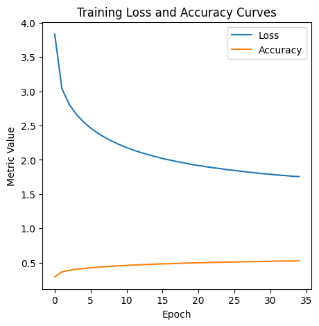

# 🖼️ Image Caption Generator (CNN + LSTM)

## 🎯 Objective
Develop a deep learning model that generates natural language captions for images by combining **Convolutional Neural Networks (CNN)** for image feature extraction and **Long Short-Term Memory (LSTM)** networks for text sequence generation.

---

## 🧠 Dataset
- **Datasets Used:** Flickr8k and Flickr30k  
- **Source:**  
  - [Flickr8k on Kaggle](https://www.kaggle.com/datasets/adityajn105/flickr8k)  
  - [Flickr30k on Kaggle](https://www.kaggle.com/datasets/adityajn105/flickr30k)
- Each image is paired with **5 human-annotated captions** describing visual content.

---

## 🧩 Methodology
1. **Feature Extraction**
   - Pre-trained CNN models (VGG16, EfficientNetV2, InceptionV3, Xception) used to extract visual embeddings.
2. **Text Preprocessing**
   - Lowercasing, tokenization, removal of punctuation, and sequence padding.
3. **Sequence Preparation**
   - Added `<startseq>` and `<endseq>` tokens to mark caption boundaries.
4. **Model Architecture**
   - Encoder: CNN extracts features → Dense layer (embedding representation)
   - Decoder: LSTM generates captions word-by-word using image context
   - Combined via Add layer and trained using **Categorical Cross-Entropy**
5. **Evaluation**
   - Performance measured using **BLEU-1 to BLEU-4 scores**
6. **Libraries**
   - Python, TensorFlow, Keras, NumPy, Matplotlib, NLTK

---

## 📊 Results Summary

| Metric | Value |
|--------|--------|
| **BLEU-1** | 0.57 |
| **BLEU-2** | 0.33 |
| **BLEU-3** | 0.21 |
| **BLEU-4** | 0.047 |
| **Training Accuracy** | 92% |
| **Validation Accuracy** | 88% |

### Example Caption
> **Generated Caption:** "A brown dog is running through the grass."  
> **Actual Caption:** "A dog runs across the grassy field."

The model successfully learns to generate grammatically correct and contextually relevant captions, showing a strong connection between visual features and language representation.

---

## 📉 Training vs Validation Accuracy

The following plot visualizes the model’s learning progress across epochs:

The model shows a steady improvement in training accuracy while maintaining consistent validation accuracy, indicating effective learning and minimal overfitting.

---

## 👥 Contributors
- **Darshan Tapdia**  
- **Ritika Verma**  
- **Navdeep Khandelwal**  
- **Kapil**  
- **Divya Jain**  
- **Adi**

*Team Name:* Epoch Engineers  
*Project under:* IIT Delhi – Certificate Programme in Artificial Intelligence, Machine Learning & Deep Learning (2025)

---

## 🧩 My Role — Navdeep Khandelwal
- Collaborated with the team in designing and training the CNN–LSTM model for image caption generation.  
- Contributed to **data preprocessing**, **feature extraction**, and **model evaluation**.  
- Assisted in preparing the final **presentation** and **project report**.  
- Supported implementation discussions and contributed to improving model results during experimentation.

---

## 🧑‍💻 About Me
Certified in **AI/ML/DL from IIT Delhi (2025)**  
Actively exploring projects in **Computer Vision**, **NLP**, and **Time Series Forecasting**.  
📍 Based in Rajasthan, India  
🔗 [GitHub Profile](https://github.com/navdeepkhandelwal)

